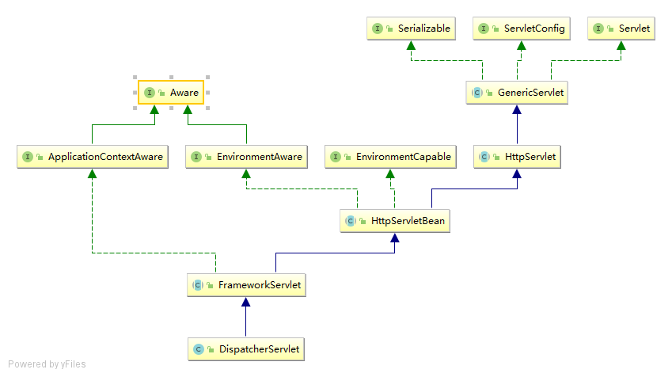

# SpringMVC学习总结

## 整体介绍

>> Servlet的整体继承结构一共有五个类，GenericServlet和HttpServlet是在Java中，HttpServletBean,FrameworkServlet和DispatcherServlet是在SpringMVC中的。
>> XXXAware在spring里表示对XXX的感知：如果某个类里面想要使用spring里面的一些东西，就可以通过事项XXXAware接口，spring看到后就会给你送给过来接受方式通过setXXX方法。
>> EnvironmentCapable，实现此接口代表可以提供Environment，当spring需要Environment的时候就会调用getEnvironment()方法。
## Servlet
Servlet是一套规范
```java
public interface Servlet {
    /**
     * 容器启动的时候运行
     */
    public void init(ServletConfig config) throws ServletException;

    /**
     * 获取ServletConfig
     */
    public ServletConfig getServletConfig();

    /**
     * 处理具体请求
     */
    public void service(ServletRequest req, ServletResponse res)
            throws ServletException, IOException;

    /**
     * 获取Servlet相关信息（需要自己实现）
     */
    public String getServletInfo();

    /**
     * 销毁时释放资源（只调用一次）
     */
    public void destroy();
}
````

```java
public interface ServletConfig {

    /**
     * 返回servlet的名称，web-xml中定义的servlet-name
     */
    public String getServletName();


    /**
     * 获取ServletContext，代表应用本身
     */
    public ServletContext getServletContext();


    /**
     * 获取init-param配置的参数
     */
    public String getInitParameter(String name);


    /**
     * 获取init-param配置的参数名称
     */
    public Enumeration<String> getInitParameterNames();
}
```
ServletConfig是Servlet级别的，而ServletContext是Context级（Application）的并不是只保存参数。
## GenericServlet
主要做了三件事：
- 实现ServletConfig接口
- 提供无参init方法
- 提供log方法
``` java
public abstract class GenericServlet implements javax.servlet.Servlet, ServletConfig, Serializable {
    private static final String LSTRING_FILE = "javax.servlet.LocalStrings";
    private static ResourceBundle lStrings =
            ResourceBundle.getBundle(LSTRING_FILE);

    private transient ServletConfig config;

    /**
     * 什么都不干，初始化方法由init方法
     */
    public GenericServlet() {
    }

    public void destroy() {
    }

    /**
     * 获取init-param配置的参数,调用ServletConfig里的方法
     */
    public String getInitParameter(String name) {
        ServletConfig sc = getServletConfig();
        if (sc == null) {
            throw new IllegalStateException(
                    lStrings.getString("err.servlet_config_not_initialized"));
        }

        return sc.getInitParameter(name);
    }

    /**
     * 获取init-param配置的参数名称，调用ServletConfig里的方法
     */
    public Enumeration<String> getInitParameterNames() {
        ServletConfig sc = getServletConfig();
        if (sc == null) {
            throw new IllegalStateException(
                    lStrings.getString("err.servlet_config_not_initialized"));
        }

        return sc.getInitParameterNames();
    }

    /**
     * 返回ServletConfig
     */
    public ServletConfig getServletConfig() {
        return config;
    }

    /**
     * 返回ServletContext，调用ServletConfig里的方法
     */
    public ServletContext getServletContext() {
        ServletConfig sc = getServletConfig();
        if (sc == null) {
            throw new IllegalStateException(
                    lStrings.getString("err.servlet_config_not_initialized"));
        }

        return sc.getServletContext();
    }

    public String getServletInfo() {
        return "";
    }

    /**
     * 实现了Servlet的init方法，保存ServletConfig然后条用无参init方法
     */
    public void init(ServletConfig config) throws ServletException {
        this.config = config;
        this.init();
    }

    /**
     * 模板方法，子类实现
     */
    public void init() throws ServletException {

    }

    /**
     * 记录日志，传递给ServletContext的日志实现
     */
    public void log(String msg) {
        getServletContext().log(getServletName() + ": " + msg);
    }

    /**
     * 记录异常，传递给ServletContext的日志实现
     */
    public void log(String message, Throwable t) {
        getServletContext().log(getServletName() + ": " + message, t);
    }

    public abstract void service(ServletRequest req, ServletResponse res)
            throws ServletException, IOException;

    public String getServletName() {
        ServletConfig sc = getServletConfig();
        if (sc == null) {
            throw new IllegalStateException(
                    lStrings.getString("err.servlet_config_not_initialized"));
        }

        return sc.getServletName();
    }
}
```
### HttpServlet
HttpServlet是用于Http协议实现的Servlet的基类。重写类service方法，将ServletResopnse与ServletRequest转换为HttpServletResopnse与HttpServletRequest，然后根据Http请求类型的不同调用不同的方法
```java
@Override
public void service(ServletRequest req, ServletResponse res)
        throws ServletException, IOException
{
    HttpServletRequest  request;
    HttpServletResponse response;
    //如果请求类型不相符，则抛出异常
    if (!(req instanceof HttpServletRequest &&
            res instanceof HttpServletResponse)) {
        throw new ServletException("non-HTTP request or response");
    }
    // 转换request与response类型
    request = (HttpServletRequest) req;
    response = (HttpServletResponse) res;
    // 调用http的处理方法
    service(request, response);
}
protected void service(HttpServletRequest req, HttpServletResponse resp)
        throws ServletException, IOException
{
    String method = req.getMethod();
    // 根据不同类型调用不同方法
    if (method.equals(METHOD_GET)) {
        // 对是否过期进行检查,如果没过期直接304使用缓存
        long lastModified = getLastModified(req);
        if (lastModified == -1) {
            doGet(req, resp);
        } else {
            long ifModifiedSince = req.getDateHeader(HEADER_IFMODSINCE);
            if (ifModifiedSince < lastModified) {
                maybeSetLastModified(resp, lastModified);
                doGet(req, resp);
            } else {
                resp.setStatus(HttpServletResponse.SC_NOT_MODIFIED);
            }
        }

    } else if (method.equals(METHOD_HEAD)) {
        long lastModified = getLastModified(req);
        maybeSetLastModified(resp, lastModified);
        // 调用doGet(),返回Body为空的Reponse
        doHead(req, resp);
    } else if (method.equals(METHOD_POST)) {
        doPost(req, resp);
    } else if (method.equals(METHOD_PUT)) {
        doPut(req, resp);
    } else if (method.equals(METHOD_DELETE)) {
        doDelete(req, resp);
    } else if (method.equals(METHOD_OPTIONS)) {
        // 调试
        doOptions(req,resp);
    } else if (method.equals(METHOD_TRACE)) {
        // 诊断服务器
        doTrace(req,resp);
    } else {
        String errMsg = lStrings.getString("http.method_not_implemented");
        Object[] errArgs = new Object[1];
        errArgs[0] = method;
        errMsg = MessageFormat.format(errMsg, errArgs);
        resp.sendError(HttpServletResponse.SC_NOT_IMPLEMENTED, errMsg);
    }
}
```
HttpServlet将不同请求路由的不同方法,而SpringMVC中有将请求合并统一到一个方法进行处理.

### HttpServletBean
>> Servlet创建的时候可以直接条用无参init方法，HttpServletBean的int方法。

```java 

@Override
public final void init() throws ServletException {
    if (logger.isDebugEnabled()) {
        logger.debug("Initializing servlet '" + getServletName() + "'");
    }

    // Set bean properties from init parameters.
    try {
        // 将Servlet中配置的参数封装到pvs变量中，requiredProperties为必须参数，如果没有报异常
        PropertyValues pvs = new ServletConfigPropertyValues(getServletConfig(), this.requiredProperties);
        BeanWrapper bw = PropertyAccessorFactory.forBeanPropertyAccess(this);
        ResourceLoader resourceLoader = new ServletContextResourceLoader(getServletContext());
        bw.registerCustomEditor(Resource.class, new ResourceEditor(resourceLoader, getEnvironment()));
        // 模板方法，在子类实现,做初始化工作，
        initBeanWrapper(bw);
        // 将初始化值设置到DispatcherServlet
        bw.setPropertyValues(pvs, true);
    }
    catch (BeansException ex) {
        logger.error("Failed to set bean properties on servlet '" + getServletName() + "'", ex);
        throw ex;
    }

    // 模板方法，之类的初始化入口
    initServletBean();

    if (logger.isDebugEnabled()) {
        logger.debug("Servlet '" + getServletName() + "' configured successfully");
    }
}
```
BeanWrapper是Spring提供的一个可以操作javaBean的工具，可以直接修改javaBean的属性值。
### FrameworkServlet
从HttpServletBean知，FrameworkServlet的入口方法为initServletBean()。

```java
@Override
protected final void initServletBean() throws ServletException {
    getServletContext().log("Initializing Spring FrameworkServlet '" + getServletName() + "'");
    if (this.logger.isInfoEnabled()) {
        this.logger.info("FrameworkServlet '" + getServletName() + "': initialization started");
    }
    long startTime = System.currentTimeMillis();

    try {
        // 初始化webApplicationContext
        this.webApplicationContext = initWebApplicationContext();
        // 初始化FrameworkServlet，模板方法子类可以实现
        initFrameworkServlet();
    }
    catch (ServletException ex) {
        this.logger.error("Context initialization failed", ex);
        throw ex;
    }
    catch (RuntimeException ex) {
        this.logger.error("Context initialization failed", ex);
        throw ex;
    }

    if (this.logger.isInfoEnabled()) {
        long elapsedTime = System.currentTimeMillis() - startTime;
        this.logger.info("FrameworkServlet '" + getServletName() + "': initialization completed in " +
                elapsedTime + " ms");
    }
}
```
FrameworkServlet的构建过程主要就是初始化webApplicationContext().
```java
protected WebApplicationContext initWebApplicationContext() {
    // 获取rootContext
    WebApplicationContext rootContext =
            WebApplicationContextUtils.getWebApplicationContext(getServletContext());
    WebApplicationContext wac = null;
    // 如果已经通过构造方法设置了webApplicationContext
    if (this.webApplicationContext != null) {
        wac = this.webApplicationContext;
        if (wac instanceof ConfigurableWebApplicationContext) {
            ConfigurableWebApplicationContext cwac = (ConfigurableWebApplicationContext) wac;
            if (!cwac.isActive()) {
                if (cwac.getParent() == null) {
                    cwac.setParent(rootContext);
                }
                configureAndRefreshWebApplicationContext(cwac);
            }
        }
    }
    if (wac == null) {
        // 当webApplicationContext已经存在在ServletContext中时，通过配置在Servlet中的contextAttribute参数获取
        wac = findWebApplicationContext();
    }
    if (wac == null) {
        // webApplicationContext没有创建就创建一个。
        wac = createWebApplicationContext(rootContext);
    }

    if (!this.refreshEventReceived) {
        // refreshEventReceived没有触发调用此方法，模板方法子类实现
        onRefresh(wac);
    }

    if (this.publishContext) {
        // 将ApplicationContext保存到ServletContext中
        String attrName = getServletContextAttributeName();
        getServletContext().setAttribute(attrName, wac);
        if (this.logger.isDebugEnabled()) {
            this.logger.debug("Published WebApplicationContext of servlet '" + getServletName() +
                    "' as ServletContext attribute with name [" + attrName + "]");
        }
    }

    return wac;
}
```
- 获取rootContext根容器的key为：org.springframework.web.context.WebApplicationContext.ROOT
- 设置webApplicationContext并根据情况调用onRefresh方法